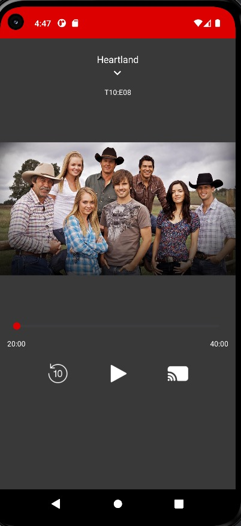
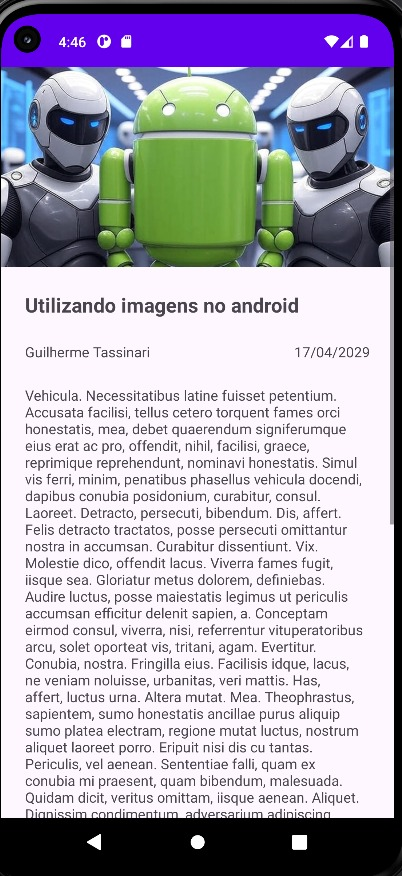
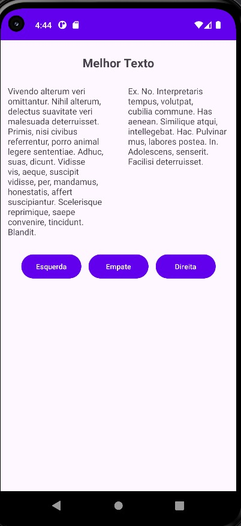

Hello!

The project includes a main Activity that leads to three other activities. Here's what was done in them:

- Main Activity with three buttons to navigate to the other activities.
- In the Blog Activity, I used a dependency in Gradle (in the App folder) to generate a lorem ipsum random text, like a blog post. The entire ConstraintLayout is wrapped in a ScrollView, allowing scrolling.
- In the Series Activity, I made a simple copy of a wireframe for a series-watching app, testing placing images and properly managing the ConstraintLayout.
- In the BestTextActivity, I used the LoremIpsum dependency. The goal was a wireframe to decide which of two texts is better, with buttons linked to a barrier below the text so they adapt dynamically.

Below are three images of the project.

